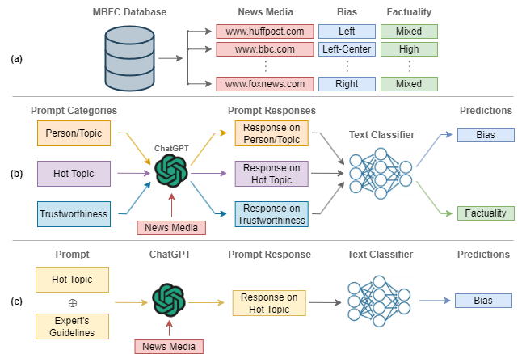
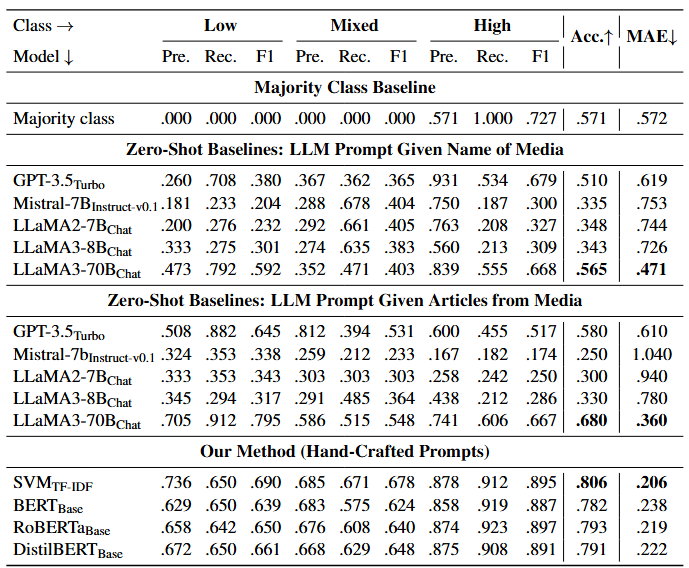
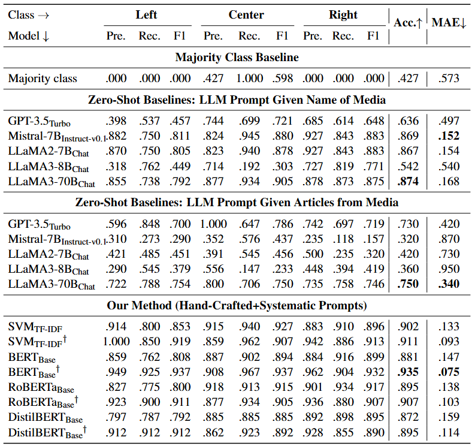
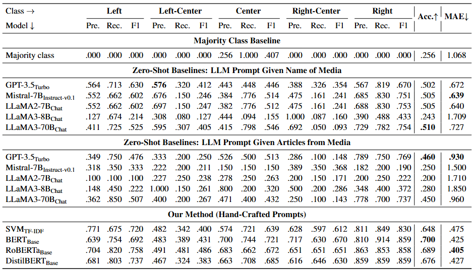
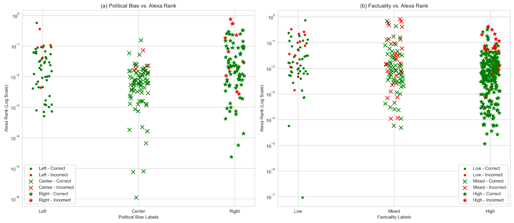
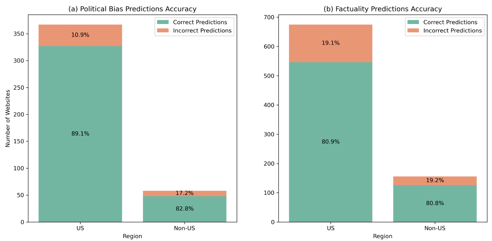

# Profiling News Media for Factuality and Bias Using LLMs and the Fact-Checking Methodology of Human Experts
<p align="center"> <a href="https://www.linkedin.com/in/zainmujahid/" target="_blank">Zain Muhammad Mujahid</a>, <a href="https://www.linkedin.com/in/dilshod-azizov1999/" target="_blank">Dilshod Azizov</a>, <a href="https://www.linkedin.com/in/maha-tufail-agro/" target="_blank">Maha Tufail Agro</a>,  <a href="https://mbzuai.ac.ae/study/faculty/preslav-nakov/" target="_blank">Preslav Nakov</a>
<p align="center" float="left">
  
  
</p>


[]()
[]()

## 📰 Abstract

In an age characterized by the proliferation of mis- and disinformation online, it is critical to empower readers to understand the content they are reading. Important efforts in this direction rely on manual or automatic fact-checking, which can be challenging for emerging claims with limited information. Such scenarios can be handled by assessing the reliability and the political bias of the source of the claim, i.e., characterizing entire news outlets rather than individual claims or articles. This is an important but understudied research direction. While prior work has looked into linguistic and social contexts, we do not analyze individual articles or information in social media. Instead, we propose a novel methodology that mimics the criteria that professional fact-checkers use to assess the factuality and political bias of an entire outlet. Specifically, we design a variety of prompts based on these criteria, and we elicit responses from large language models (LLMs), which we aggregate to make predictions. In addition to demonstrating sizable improvements over strong baselines via extensive experiments with multiple LLMs, we provide an in-depth error analysis of the effect of media popularity and region on model performance. We further conduct an ablation study to highlight the key components of our dataset that contribute to these improvements.

<p align="center" width="100%"><a href="https://github.com/mbzuai-nlp/llm-media-profiling" target="_blank">GitHub</a>, <a href="" target="_blank">Paper</a></p>

<p align="center" width="100%">
    <a></a>
</p>

<!-- TOC -->
- [Methodology](https://github.com/zainmujahid/llm-media-profiling?tab=readme-ov-file#-methodology)
    - [Handcrafted Prompts](https://github.com/zainmujahid/llm-media-profiling?tab=readme-ov-file#handcrafted-prompts)
    - [Systematic Prompts Based on Expert Criteria](https://github.com/zainmujahid/llm-media-profiling?tab=readme-ov-file#systematic-prompts-based-on-expert-criteria)
- [Dataset](https://github.com/zainmujahid/llm-media-profiling?tab=readme-ov-file#%EF%B8%8F-dataset)
- [Results](https://github.com/zainmujahid/llm-media-profiling?tab=readme-ov-file#-results)
    - [Factuality Prediction](https://github.com/zainmujahid/llm-media-profiling?tab=readme-ov-file#factuality-prediction)
    - [Political Bias Prediction](https://github.com/zainmujahid/llm-media-profiling?tab=readme-ov-file#political-bias-prediction)
    - [Impact of Media Popularity](https://github.com/zainmujahid/llm-media-profiling?tab=readme-ov-file#impact-of-media-popularity)
- [Citation](https://github.com/zainmujahid/llm-media-profiling?tab=readme-ov-file#-citation)
<!-- /TOC -->

## 📊 Methodology

We adopt two main prompt strategies to elicit outlet-level insights from LLMs:

### Handcrafted Prompts
- 18 manually curated prompts across:
    - Stance on public figures/topics
    - Stancw on current popular issues
    - Trustworthiness & factuality

### Systematic Prompts Based on Expert Criteria
- We mimic the methodology employed by fact-checking journalists across 16 policy areas.
- The LLM is asked to provide left/right leaning and reasoning for each.

These LLM responses are concatenated and passed to text classification models. We also present two case studies where we obtain zero-shot predictions from the LLMs by providing the media name and some of its recently published articles.

## 🗃️ Dataset
- 4,192 media outlets annotated for factuality of reporting
- 3,649 outlets annotated for political bias
- Factuality: ```low```, ```mixed```, ```high```
- Bias: ```left```, ```left-center```, ```center```, ```right-center```, ```right```

## 📈 Results

### Factuality Prediction
Evaluation results for the experiments on our dataset for predicting the factuality of the reporting of the news media, grouped by different modeling methodologies.

<p align="center" width="100%">
    <a></a>
</p>

### Political Bias Prediction

Evaluation results for the political bias prediction task (3 and 5 class), grouped according to the different modeling methods used. Each model marked with the symbol $\dagger$ was trained on data from the systematic prompts.

<p align="center" width="100%">
    <a></a>
</p>

<p align="center" width="100%">
    <a></a>
</p>


### Impact of Media Popularity

Best model performance vs. media outlet popularity. (a) Political bias labels, and (b) Factuality labels plotted against Alexa Rank (log scale). Each point represents a media outlet with its original label. Green markers indicate correct predictions, and red markers indicate errors. A lower Alexa Rank means a more popular medium.

<p align="center" width="100%">
    <a></a>
</p>

Correct vs. incorrect predictions for U.S. and non-U.S. media outlets, highlighting higher accuracy for U.S.-based outlets.

<p align="center" width="100%">
    <a></a>
</p>

## 📌 Citation
Please cite us if you use our data or methodology.
```bibtex
TBD
```
